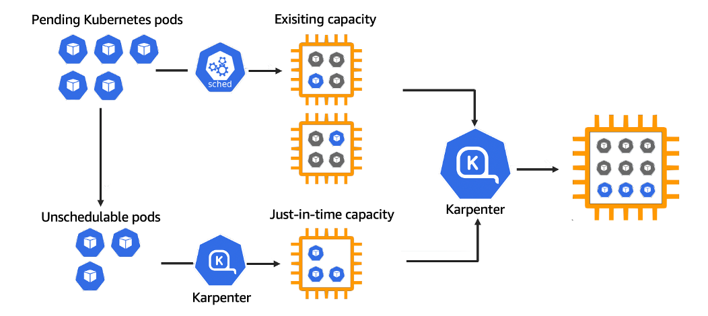

# Implementing Karpenter In EKS (From Start To Finish)

https://www.cloudnativedeepdive.com/implementing-karpenter-in-eks-from-start-to-finish/




Without a cluster that can properly scale Nodes both up and down, the cluster can never perform as expected. Not only that, but engineers are forced to manage the scalability of a cluster manually. Both of these points can be rectified with proper resource optimization.

In this blog post, you'll learn step-by-step how to get Karpenter up and running on EKS from the IAM role to the permissions and the deployment of Karpenter itself.

## Prerequisites
To follow along with this blog post, you should have the following:

An AWS account. If you don't already have an account, you can sign up for one here.
## High-Level Steps
There are a few things that you'll have to do to get Karpenter installed successfully:

Create the EKS cluster where Karpenter is going to run.
Add the OIDC URL from the cluster to IAM Providers.
Create a new IAM Role that has permissions to scale EC2 instances (the worker nodes) via Karpenter
Because it's being connected via IRSA (IAM Roles for Service Accounts), the Service Account will get automatically created as the OIDC URL for the EKS cluster is attached in IAM.
Run the Helm Chart to deploy Karpenter
In the sections to come, you'll learn how to do each step from a programmatic perspective using Terraform

## Create The EKS Cluster
To create the AWS EKS cluster, you'll use Terraform if you're following along within this blog post. If you already have an EKS cluster, you can skip this section.

1. Ensure that there is an S3 bucket so the tfstate can be stored somewhere that isnt' local or ephemeral.

```terraform {
  backend "s3" {
    bucket = "name_of_your_bucket"
    key    = "eks-terraform-workernodes.tfstate"
    region = "us-east-1"
  }
  required_providers {
    aws = {
      source = "hashicorp/aws"
    }
  }
}
```
2. Create the first IAM Role, which is for the EKS Control Plane.

```
resource "aws_iam_role" "eks-iam-role" {
  name = "k8squickstart-eks-iam-role"

  path = "/"

  assume_role_policy = <<EOF
{
  "Version": "2012-10-17",
  "Statement": [
    {
      "Effect": "Allow",
      "Principal": {
        "Service": "eks.amazonaws.com"
      },
      "Action": "sts:AssumeRole"
    }
  ]
}
EOF
}
```

3. The Control Plane needs the following AWS IAM Policies.

```
resource "aws_iam_role_policy_attachment" "AmazonEKSClusterPolicy" {
  policy_arn = "arn:aws:iam::aws:policy/AmazonEKSClusterPolicy"
  role       = aws_iam_role.eks-iam-role.name
}
resource "aws_iam_role_policy_attachment" "AmazonEC2ContainerRegistryReadOnly-EKS" {
  policy_arn = "arn:aws:iam::aws:policy/AmazonEC2ContainerRegistryReadOnly"
  role       = aws_iam_role.eks-iam-role.name
}

## Create the EKS cluster
resource "aws_eks_cluster" "k8squickstart-eks" {
  name = "k8squickstart-cluster"
  role_arn = aws_iam_role.eks-iam-role.arn

  enabled_cluster_log_types = ["api", "audit", "scheduler", "controllerManager"]
  version = var.k8sVersion
  vpc_config {
    subnet_ids = [var.subnet_id_1, var.subnet_id_2]
  }

  depends_on = [
    aws_iam_role.eks-iam-role,
  ]
}
```

4. Create the Control Plane.

```
resource "aws_eks_cluster" "k8squickstart-eks" {
  name = "k8squickstart-cluster"
  role_arn = aws_iam_role.eks-iam-role.arn

  enabled_cluster_log_types = ["api", "audit", "scheduler", "controllerManager"]
  version = var.k8sVersion
  vpc_config {
    subnet_ids = [var.subnet_id_1, var.subnet_id_2]
  }

  depends_on = [
    aws_iam_role.eks-iam-role,
  ]
}
```

5. Create the IAM Role for the Worker Nodes. Because AWS splits up the configuration between the Control Plane and the Worker Nodes (Node Groups), another IAM Role and policies are needed.

```
resource "aws_iam_role" "workernodes" {
  name = "eks-node-group-example"

  assume_role_policy = jsonencode({
    Statement = [{
      Action = "sts:AssumeRole"
      Effect = "Allow"
      Principal = {
        Service = "ec2.amazonaws.com"
      }
    }]
    Version = "2012-10-17"
  })
}
```

6. Attach the policies to the IAM Role for the Worker Nodes. Notice how there are a fair amount if policies needed. This is because the Worker Nodes are calling upon EC2 instances, so a lot of permissions are needed to create Worker Nodes within an EKS Node Group.

```
resource "aws_iam_role_policy_attachment" "AmazonEKSWorkerNodePolicy" {
  policy_arn = "arn:aws:iam::aws:policy/AmazonEKSWorkerNodePolicy"
  role       = aws_iam_role.workernodes.name
}

resource "aws_iam_role_policy_attachment" "AmazonEKS_CNI_Policy" {
  policy_arn = "arn:aws:iam::aws:policy/AmazonEKS_CNI_Policy"
  role       = aws_iam_role.workernodes.name
}

resource "aws_iam_role_policy_attachment" "EC2InstanceProfileForImageBuilderECRContainerBuilds" {
  policy_arn = "arn:aws:iam::aws:policy/EC2InstanceProfileForImageBuilderECRContainerBuilds"
  role       = aws_iam_role.workernodes.name
}

resource "aws_iam_role_policy_attachment" "AmazonEC2ContainerRegistryReadOnly" {
  policy_arn = "arn:aws:iam::aws:policy/AmazonEC2ContainerRegistryReadOnly"
  role       = aws_iam_role.workernodes.name
}

resource "aws_iam_role_policy_attachment" "CloudWatchAgentServerPolicy-eks" {
  policy_arn = "arn:aws:iam::aws:policy/CloudWatchAgentServerPolicy"
  role       = aws_iam_role.workernodes.name
}

resource "aws_iam_role_policy_attachment" "AmazonEBSCSIDriverPolicy" {
  policy_arn = "arn:aws:iam::aws:policy/service-role/AmazonEBSCSIDriverPolicy"
  role       = aws_iam_role.workernodes.name
}
```

7. Create the Worker Nodes.

```
resource "aws_eks_node_group" "worker-node-group" {
  cluster_name    = aws_eks_cluster.k8squickstart-eks.name
  node_group_name = "k8squickstart-workernodes"
  node_role_arn   = aws_iam_role.workernodes.arn
  subnet_ids      = [var.subnet_id_1, var.subnet_id_2]
  instance_types = ["t3.2xlarge"]

  scaling_config {
    desired_size = var.desired_size
    max_size     = 4
    min_size     = var.min_size
  }

  depends_on = [
    aws_iam_role_policy_attachment.AmazonEKSWorkerNodePolicy,
    aws_iam_role_policy_attachment.AmazonEKS_CNI_Policy,
    #aws_iam_role_policy_attachment.AmazonEC2ContainerRegistryReadOnly,
  ]
}
```

8. The final step is to add the CSI addon in EKS.

```
resource "aws_eks_addon" "csi" {
  cluster_name = aws_eks_cluster.k8squickstart-eks.name
  addon_name   = "aws-ebs-csi-driver"
}
```

9. Putting it all together, the configuration should look like the below. Ensure to create a main.tf to add the following Terraform code to.

```
terraform {
  backend "s3" {
    bucket = "name_of_your_bucket"
    key    = "eks-terraform-workernodes.tfstate"
    region = "us-east-1"
  }
  required_providers {
    aws = {
      source = "hashicorp/aws"
    }
  }
}


# IAM Role for EKS to have access to the appropriate resources
resource "aws_iam_role" "eks-iam-role" {
  name = "k8squickstart-eks-iam-role"

  path = "/"

  assume_role_policy = <<EOF
{
  "Version": "2012-10-17",
  "Statement": [
    {
      "Effect": "Allow",
      "Principal": {
        "Service": "eks.amazonaws.com"
      },
      "Action": "sts:AssumeRole"
    }
  ]
}
EOF

}

## Attach the IAM policy to the IAM role
resource "aws_iam_role_policy_attachment" "AmazonEKSClusterPolicy" {
  policy_arn = "arn:aws:iam::aws:policy/AmazonEKSClusterPolicy"
  role       = aws_iam_role.eks-iam-role.name
}
resource "aws_iam_role_policy_attachment" "AmazonEC2ContainerRegistryReadOnly-EKS" {
  policy_arn = "arn:aws:iam::aws:policy/AmazonEC2ContainerRegistryReadOnly"
  role       = aws_iam_role.eks-iam-role.name
}

## Create the EKS cluster
resource "aws_eks_cluster" "k8squickstart-eks" {
  name = "k8squickstart-cluster"
  role_arn = aws_iam_role.eks-iam-role.arn

  enabled_cluster_log_types = ["api", "audit", "scheduler", "controllerManager"]
  version = var.k8sVersion
  vpc_config {
    subnet_ids = [var.subnet_id_1, var.subnet_id_2]
  }

  depends_on = [
    aws_iam_role.eks-iam-role,
  ]
}

## Worker Nodes
resource "aws_iam_role" "workernodes" {
  name = "eks-node-group-example"

  assume_role_policy = jsonencode({
    Statement = [{
      Action = "sts:AssumeRole"
      Effect = "Allow"
      Principal = {
        Service = "ec2.amazonaws.com"
      }
    }]
    Version = "2012-10-17"
  })
}

resource "aws_iam_role_policy_attachment" "AmazonEKSWorkerNodePolicy" {
  policy_arn = "arn:aws:iam::aws:policy/AmazonEKSWorkerNodePolicy"
  role       = aws_iam_role.workernodes.name
}

resource "aws_iam_role_policy_attachment" "AmazonEKS_CNI_Policy" {
  policy_arn = "arn:aws:iam::aws:policy/AmazonEKS_CNI_Policy"
  role       = aws_iam_role.workernodes.name
}

resource "aws_iam_role_policy_attachment" "EC2InstanceProfileForImageBuilderECRContainerBuilds" {
  policy_arn = "arn:aws:iam::aws:policy/EC2InstanceProfileForImageBuilderECRContainerBuilds"
  role       = aws_iam_role.workernodes.name
}

resource "aws_iam_role_policy_attachment" "AmazonEC2ContainerRegistryReadOnly" {
  policy_arn = "arn:aws:iam::aws:policy/AmazonEC2ContainerRegistryReadOnly"
  role       = aws_iam_role.workernodes.name
}

resource "aws_iam_role_policy_attachment" "CloudWatchAgentServerPolicy-eks" {
  policy_arn = "arn:aws:iam::aws:policy/CloudWatchAgentServerPolicy"
  role       = aws_iam_role.workernodes.name
}

resource "aws_iam_role_policy_attachment" "AmazonEBSCSIDriverPolicy" {
  policy_arn = "arn:aws:iam::aws:policy/service-role/AmazonEBSCSIDriverPolicy"
  role       = aws_iam_role.workernodes.name
}
resource "aws_eks_node_group" "worker-node-group" {
  cluster_name    = aws_eks_cluster.k8squickstart-eks.name
  node_group_name = "k8squickstart-workernodes"
  node_role_arn   = aws_iam_role.workernodes.arn
  subnet_ids      = [var.subnet_id_1, var.subnet_id_2]
  instance_types = ["t3.2xlarge"]

  scaling_config {
    desired_size = var.desired_size
    max_size     = 4
    min_size     = var.min_size
  }

  depends_on = [
    aws_iam_role_policy_attachment.AmazonEKSWorkerNodePolicy,
    aws_iam_role_policy_attachment.AmazonEKS_CNI_Policy,
    #aws_iam_role_policy_attachment.AmazonEC2ContainerRegistryReadOnly,
  ]
}

resource "aws_eks_addon" "csi" {
  cluster_name = aws_eks_cluster.k8squickstart-eks.name
  addon_name   = "aws-ebs-csi-driver"
}
```

10. The next step is the `variables.tf` file, which you can find below:
```
variable "subnet_id_1" {
  type = string
  default = ""
}

variable "subnet_id_2" {
  type = string
  default = ""
}

variable "desired_size" {
  type = string
  default = 3
}
variable "min_size" {
  type = string
  default = 3
}

variable "k8sVersion" {
  default = "1.32"
  type = string
}
```
